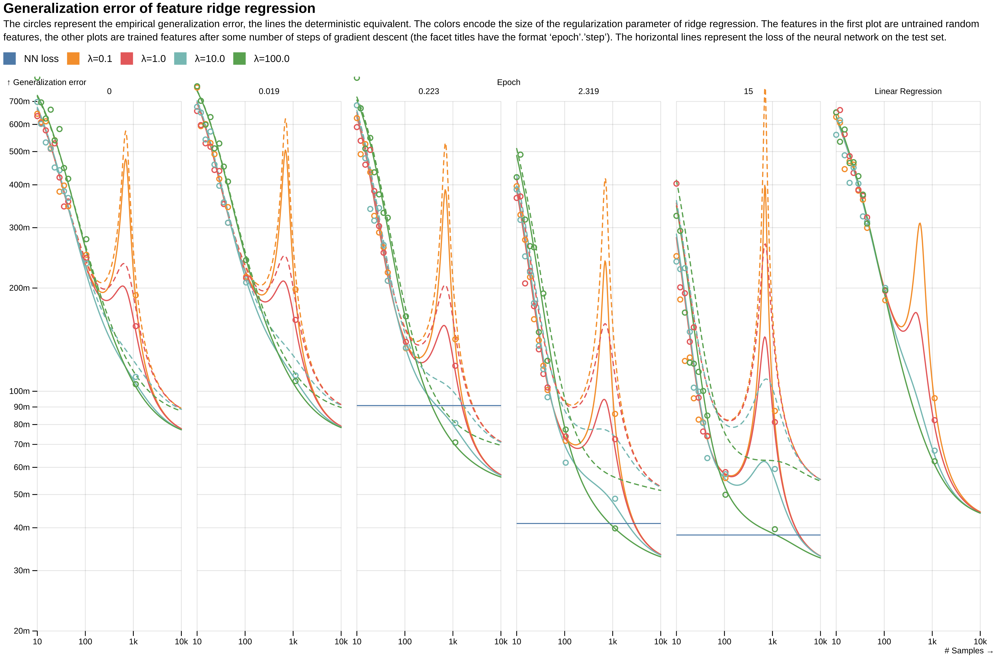
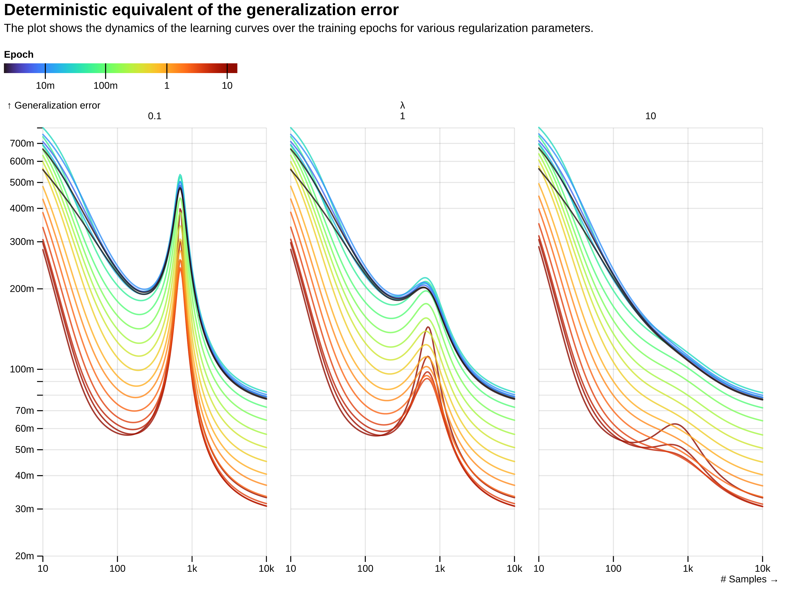

# Asymptotics of Learning with Deep Structured (Random) Features

Supplementary Material for [arXiv:2402.13999](https://arxiv.org/abs/2402.13999)

The file `feature_ridge_regression.ipynb` contains the code to generate the following figures:

